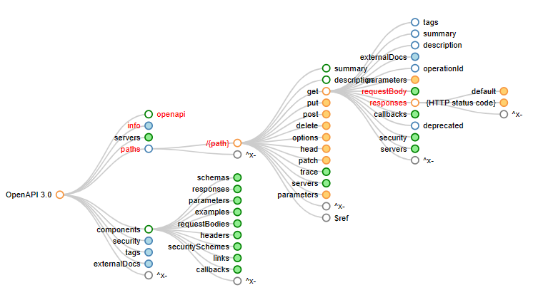

# GCPIntroduction RESTful APIs

# Prerequisites

1. GCP Account

# Background

We will use following technologies:
1. OpenAPI Spec
2. API Gateway
3. Serverless Compute with Node runtime
4. Docker

## What is openAPI?

standard for building and documenting Restful APIs (language-agnostic)

APIs can be represented as trees:

A more detailed look on the obejcts:

## Api Gateway

### Managed Tasks by an API Gateway
- **Authentication**: Ensures that API calls are made by authorized users.
- **Routing**: Directs incoming API calls to the appropriate backend services.
- **Rate Limiting**: Prevents API overuse by restricting the number of requests a user can make in a certain time frame.
- **Billing**: Integrates with billing systems to manage charges for API usage.
- **Monitoring**: Keeps track of API performance and usage.
- **Analytics**: Provides insights into API usage patterns and performance metrics.

### Key Ideas and Concepts
- **Decoupling Client and Backend**: An API gateway abstracts the backend service details from the client, simplifying client integration.
- **Microservices Architecture Support**: Facilitates communication between microservices, essential in DevOps environments where services are frequently updated and deployed.
- **Serverless Support**: Manages serverless functions and applications, handling the execution of serverless code in response to events.
- **Scalability and Flexibility**: Supports the scaling of backend services without impacting the client interface.

## Serverless

important key-words:
- event driven
- SaaS

Here’s a simple analogy to make it easier to understand how serverless computing works:

Think of serverless like getting water to your home. You could dig your own well, test the water quality, and install and maintain all the external plumbing needed to run it into the house. Or, you can connect to your city’s main water supply. You just turn the water tap and get as much water as you want exactly when you need it, and the city sends you a monthly bill for the exact amount of water you consume.

# Getting Started
These instructions will get you a copy of the project up and running on your local machine for development and testing purposes.

Installation
Step-by-step series of examples and explanations on how to set up a development environment:

Clone the repo:
bash
Copy code
git clone https://github.com/yourusername/yourprojectname.git
Navigate to the project directory:
bash
Copy code
cd yourprojectname
Install dependencies:
bash
Copy code
# If using npm
npm install

# If using pip
pip install -r requirements.txt
Running the project
Explain how to run the automated tests for this system or how to start the project if it’s an application:

bash
Copy code
# Example command to run the project
python main.py
# or
npm start
Usage
A section dedicated to showing useful examples of how your project can be used. Add snippets of code or commands that can be used to demonstrate how your project can be utilized.

Contributing
Instructions for how other developers can contribute to the project. Typically includes:

Fork the Project
Create your Feature Branch (git checkout -b feature/AmazingFeature)
Commit your Changes (git commit -m 'Add some AmazingFeature')
Push to the Branch (git push origin feature/AmazingFeature)
Open a Pull Request
Code of Conduct
Include a short note on the expected behaviors and link to the full code of conduct document.

# License
State the license under which the project is released, and include a link to the license file.

Acknowledgments
Hat tip to anyone whose code was used
Inspiration
etc.
Contact
Your Name – @YourTwitter - email@example.com

Project Link: https://github.com/yourusername/yourprojectname

